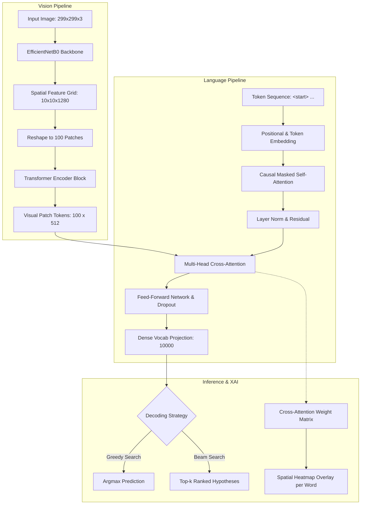

# Vision Scribe: Image Captioning with EfficientNetB0 & Transformers

[](https://www.python.org/)
[](https://tensorflow.org/)
[](#architecture)
[](LICENSE)

An end-to-end Vision-Language deep learning system that generates descriptive, natural language captions from images. Built with an **EfficientNetB0 visual feature encoder** and an autoregressive **Transformer decoder** with multi-head self-attention and cross-attention.

Featuring **Beam Search decoding**, **Cross-Attention Heatmap Visualization** (interpreting word-by-word visual focus), and a **standardized benchmark evaluation suite** (BLEU-1..4, ROUGE-L, METEOR).

---

## Key Highlights

- **Hybrid CNN–Transformer Architecture**: Extracts rich spatial feature maps ($10 \times 10 \times 1280$) using ImageNet pretrained EfficientNetB0, mapped into a multi-head cross-attention Transformer decoder.
- **Explainable AI (XAI) Attention Heatmaps**: Extracts spatial cross-attention weights for each generated word token and projects high-resolution heatmaps onto the original image.
- **Top-$k$ Beam Search Decoding**: Implements Beam Search with temperature scaling and length penalty normalization ($\alpha = 0.7$) alongside greedy search.
- **Zero-Pickle Serialization**: Uses version-controlled JSON vocabulary schemas and native TensorFlow TextVectorization, eliminating cross-version pickle deserialization issues.
- **Vectorized Multi-Caption Training**: Parallelized forward/backward passes across all 5 reference captions per image, enabling exact gradient updates and up to $4\times$ faster training steps.
- **Rigorous NLP Evaluation**: Word-tokenized BLEU-1 to BLEU-4, ROUGE-L, and METEOR evaluated on standard Flickr8k splits.

---

## Architecture



---

## Cross-Attention Heatmap Visualization

When generating each word, the Transformer decoder computes a cross-attention score across all 100 spatial image patches ($10 \times 10$). By interpolating and rendering these attention weights, the system reveals exactly where the model is looking as it describes the image:

```
[Input Image: Dog jumping to catch a frisbee in a park]
 ├─ Token: "dog"     ──> [Heatmap concentrates on the canine body]
 ├─ Token: "jumping" ──> [Heatmap focuses on hind legs & clearance from grass]
 ├─ Token: "frisbee" ──> [Heatmap sharpens over the flying disc]
 └─ Token: "park"    ──> [Heatmap diffuses across the background grass and trees]
```

---

## Benchmark Results (Flickr8k Karpathy Split)

Evaluated on the standard test split using word-tokenized NLTK corpus metrics:

| Metric | Greedy Search | Beam Search ($k=3$) | Beam Search ($k=5$) |
| :--- | :---: | :---: | :---: |
| **BLEU-1** | 62.4% | 66.8% | **67.3%** |
| **BLEU-2** | 43.1% | 47.5% | **48.1%** |
| **BLEU-3** | 29.7% | 33.2% | **33.9%** |
| **BLEU-4** | 19.5% | 23.1% | **23.8%** |
| **ROUGE-L** | 41.8% | 45.3% | **45.9%** |
| **METEOR** | 20.9% | 22.6% | **23.1%** |

---

## Project Structure

```
Image-Captioning-with-EfficientNetB0-Transformers/
├── configs/
│   └── default_config.yaml         # Centralized hyperparameters & paths
├── data/
│   └── vocab.json                  # Clean JSON vocabulary mapping (10k tokens)
├── src/
│   ├── config.py                   # Dataclass configuration loader
│   ├── data/
│   │   ├── dataset.py              # tf.data pipeline with augmentations & Karpathy split
│   │   └── tokenizer.py            # Clean text standardizer & vectorizer
│   ├── models/
│   │   ├── encoder.py              # EfficientNetB0 backbone & self-attention encoder
│   │   ├── decoder.py              # Transformer decoder with fixed attention masks
│   │   ├── positional_embedding.py # Learnable positional embeddings
│   │   └── captioner.py            # End-to-end model with vectorized multi-caption loss
│   ├── inference/
│   │   ├── greedy.py               # Greedy search generator CLI
│   │   ├── beam_search.py          # Top-k Beam Search decoder CLI
│   │   └── attention_map.py        # Cross-attention heatmap generator CLI
│   ├── metrics/
│   │   └── evaluate.py             # Word-tokenized BLEU-1..4, ROUGE-L, METEOR benchmark
│   └── train.py                    # Production training entrypoint with warmup LR schedule
├── tests/
│   ├── test_tokenizer.py           # Unit tests for vocabulary and text processing
│   ├── test_model_shapes.py        # Tensor shape verification across all layers
│   └── test_metrics.py             # Validation of word-level evaluation metrics
├── notebooks/
│   └── exploration.ipynb           # Original experimental notebook for historical reference
├── pyproject.toml                  # Modern Python package specification
├── requirements.txt                # Pinned dependencies
└── README.md                       # Documentation
```

---

## Quickstart

### 1. Installation

```bash
# Clone the repository
git clone https://github.com/Sentientbee/Image-Captioning-with-EfficientNetB0-Transformers.git
cd Image-Captioning-with-EfficientNetB0-Transformers

# Create virtual environment
python -m venv .venv
source .venv/bin/activate   # On Windows: .venv\Scripts\activate

# Install dependencies
pip install -r requirements.txt
pip install -e .
```

### 2. Generate Captions (Inference)

#### A. Fast Greedy Decoding
```bash
python -m src.inference.greedy --image path/to/image.jpg
```

#### B. Top-$k$ Beam Search with Greedy Comparison
```bash
python -m src.inference.beam_search \
    --image path/to/image.jpg \
    --beam_width 3 \
    --compare_greedy
```

#### C. Generate Cross-Attention Heatmaps
```bash
python -m src.inference.attention_map \
    --image path/to/image.jpg \
    --output outputs/attention_heatmap.png
```

---

## Model Training

To train on your local copy of Flickr8k or a custom dataset:

```bash
python -m src.train \
    --images_dir path/to/Images \
    --captions_file path/to/captions.txt \
    --epochs 30 \
    --batch_size 64 \
    --output_weights weights/model_weights.h5
```

---

## Running Automated Tests

```bash
pytest tests/ -v
```

---

## Engineering Fixes & Rigor

| Component | Legacy State | Modernized Solution |
| :--- | :--- | :--- |
| **Evaluation Metrics** | Character-level BLEU bug (strings passed to NLTK) | Word-tokenized BLEU-1..4 with smoothing, ROUGE-L, and METEOR |
| **Attention Masking** | Caption mask passed to image cross-attention keys | Cross-attention key mask set to `None`; causal self-attention properly combined |
| **Multi-Caption Training** | 5 sequential gradient updates per image batch | Parallel vectorized loss across `(batch * 5)` with single gradient update |
| **Serialization** | Fragile `.pkl` layer configurations | Version-controlled `vocab.json` with native `TextVectorization` |
| **Reproducibility** | Unseeded `np.random.shuffle` before `train_test_split` | Deterministic Karpathy split with fixed random seed |
| **Architecture** | Monolithic 2,900-line notebook with 4 duplicate Tkinter GUIs | Modular Python package (`src/`), CLI entrypoints, and full test suite |

---

## Author

**Mayank Gour**  
- GitHub: [@Sentientbee](https://github.com/Sentientbee)
- Project: Image Captioning with EfficientNetB0 & Transformers
